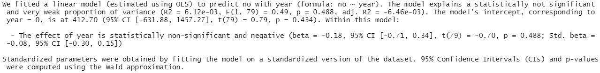
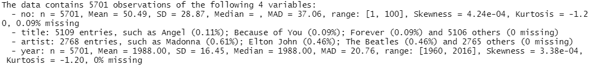
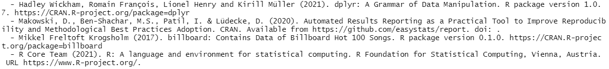
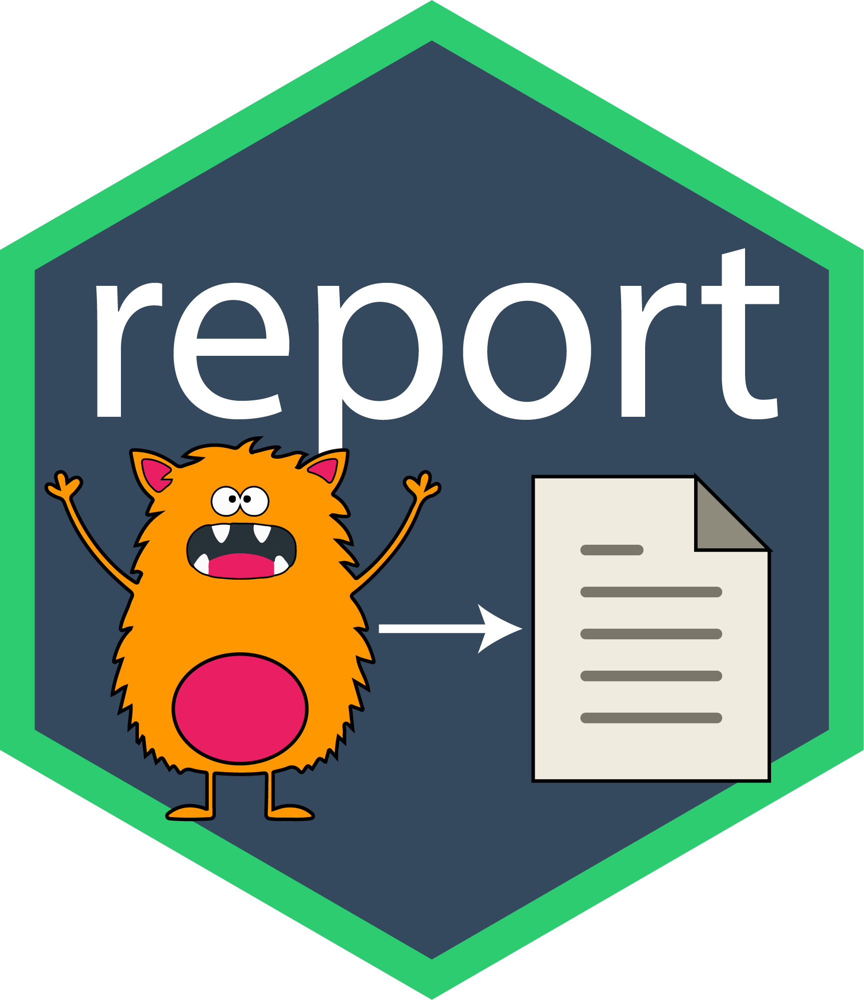

```{r setup, include = FALSE}

options(htmltools.dir.version = FALSE)
# knitr::opts_chunk$set(echo = FALSE, warning = FALSE, message = FALSE, comment = "")
knitr::opts_chunk$set(echo = TRUE, comment = "")
xaringanthemer::style_mono_accent(title_slide_background_color = "#EDF4FB",
                                  title_slide_text_color = "#000000",
                                  base_font_size = "18px")
Sys.setenv(LANG = "en")

```

# Does this look familiar?

## A Simple t-Test

* Data: **wiki_hot_100s** from the **billboard** package
* Contains Top 100 songs for each year from 1960 to 2016
* Task: Compare average song position of two artists via a simple t-Test

--

.pull-left[
```{r ttest, eval = FALSE}

options(width = 50)

library(billboard)
library(dplyr)

data("wiki_hot_100s")

top100 <- wiki_hot_100s %>% 
  mutate(across(c(no, year), as.numeric, na.rm = TRUE))      # NAs introduced by coercion

data <- top100 %>% 
  filter(artist %in% c("Britney Spears", "Maroon 5"))

t.test(no ~ artist, data = data) #<<

```
]

--

.pull-right[
```{r, ref.label = "ttest", echo = FALSE, warning = FALSE, message = FALSE}
```

]

---

# What We Want

## A Simple t-Test

```{r ttest2, echo = FALSE, message = FALSE}

options(width = 80)
library(report)
ttest <- t.test(no ~ artist, data = data)
ttest
```

--

```{r report1, echo = FALSE}

report(ttest) %>%
  stringr::str_wrap(width = 115) %>% 
  cat()

```

---

# report: Life Can Be So Simple!

```{r, eval = FALSE}

library(report)
ttest <- t.test(no ~ artist, data = data)
report(ttest) #<<

```

```{r, ref.label = "report1", echo = FALSE}
```

--

```{r ttest-stats}
report_statistics(ttest) #<<
```


---

# Second Example: A Regression Model

```{r reg1}

data2 <- top100 %>% 
  filter(artist %in% c("Rihanna", "Madonna", "Elton John"))

lm <- lm(no ~ year, data = data2)
summary(lm)

```

---

# Second Example: A Regression Model

```{r reg-text, eval = FALSE}
report(lm) #<<
```



---

# Reporting Data

```{r data-report, eval = FALSE}
report(top100) #<<
```



---

# Reporting System & Session Info

```{r system-session, eval = FALSE}
report_system()    #<<
```

```{r, echo = FALSE}
report_system() %>% 
  stringr::str_wrap(width = 100) %>% 
  cat()
```

```{r}
report_packages()  #<<
```

```{r, eval = FALSE}
cite_packages()    #<<
```

```{r, echo = FALSE}
# cite_packages() %>% 
#   stringr::str_wrap(width = 100) %>% 
#   cat()

```



---

# The report R Package

.pull-left[
### Authors

* Dominique Makowski
* Daniel Lüdecke
* Mattan S. Ben-Shachar
* Indrajeet Patil
* Brenton M. Wiernik
* Contributor: Rudolf Siegel
]

.pull-right[

]

---

# The report R Package:<br>Part of the *easystats* Ecosystem

```{r logo-easystats, out.width = "650px", fig.align = "center", echo = FALSE}
knitr::include_graphics("libs/_Images/logo-easystats.png")
```

---

class: center, middle

# Thanks!

### Youtube: StatistikinDD

### Twitter: @StatistikinDD

### github: fjodor

Slides created via the R package [**xaringan**](https://github.com/yihui/xaringan).

The chakra comes from [remark.js](https://remarkjs.com), [**knitr**](https://yihui.org/knitr), and [R Markdown](https://rmarkdown.rstudio.com).

Thanks to **Yihui Xie** for *{knitr}* and *{xaringan}* and **Garrick Aden-Buie** for *{xaringanthemer}*.