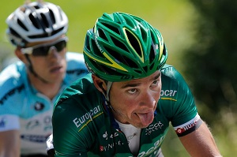
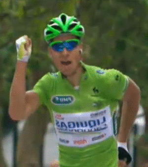

```{r setup, include = FALSE}

options(htmltools.dir.version = FALSE)
# knitr::opts_chunk$set(echo = FALSE, warning = FALSE, message = FALSE, comment = "")
knitr::opts_chunk$set(echo = TRUE, comment = "")

# Generate data

library(tidyverse)

set.seed(2021)

n <- 60

cycling <- tibble(
  group = rep(c("Serious", "Why so serious?"), each = n / 2),
  score = c(rnorm(n / 2, mean = 45, sd = 7),
            rnorm(n / 2, mean = 55, sd = 7))
) |>
  mutate(score = round(score),
         groupn = as.numeric(group == "Why so serious?")) |>
  select(group, groupn, score) |>
  slice_sample(n = n, replace = FALSE)

```


# Research Questions

.center[]

> **(1)** Is there a difference in performance  
between cyclists that are **all serious** about their training  

--

> and those who are **serious** about their training  
while still having **plenty of fun**?

--

> **(2)**How do a **t-test** for independent samples,  
a **regression model** (simple linear model)  
and **Pearson's correlation**  
compare?

---

# Introducing the Data: Cycling Heros

.pull-left[
<br>
```{r intro-data, echo = FALSE}

library(knitr)

cycling |>
  head() |>
  kable()
```
]

--

.pull-right[
<br>
```{r intro-data-code, echo = TRUE, eval = FALSE, ref.label = "intro-data"}
```

]
---

# Some Descriptives ...

.pull-left[
<br>
```{r descriptives, echo = FALSE}

library(tidyverse)

cycling |>
  group_by(group) |>
  summarise(Avg_score = round(mean(score), 1),
            Highest = max(score),
            Lowest = min(score),
            SD = round(sd(score), 1),
            n = n()) |>
  kable()

```

Two groups of cyclists training by different methods ...

]

.pull-right[
<br>
```{r descriptives-code, echo = TRUE, eval = FALSE, ref.label = "descriptives"}
```

]
---

# Visualization: Boxplot

```{r boxplot, message = FALSE, warning = FALSE, echo = FALSE, fig.align = "center"}

library(ggtext)     # show images
library(EnvStats)   # for stat_n_text()
library(ggthemes)   # theme_solarized()

labels <- c(Serious = "<br>Serious<br>*Voeckler (& Devenyns)*",
            'Why so serious?' = "<br>Why so serious?<br>*Sagan*")

ggplot(cycling, aes(x = group, y = score, color = group)) +
  geom_boxplot() +
  geom_jitter(width = 0.3) +
  stat_summary(fun = "mean", color = "black", shape = 8) +
  labs(x = "", y = "Score",
       title = "Cycling Performance by Type of Training",
       caption = "Simulated Data") +
  scale_color_manual(guide = NULL, values = c("darkgreen", "green")) +
  scale_x_discrete(name = NULL, labels = labels) +
  stat_n_text(y.pos = 1) +
  theme_solarized(base_size = 15) +
  theme(axis.text.x = element_markdown(color = "black", angle = 0))

```

---

# Visualization: Boxplot - R Code

```{r boxplot-code, echo = TRUE, eval = FALSE, ref.label = "boxplot"}
```

---

# t-test

.pull-left[
<br>
```{r ttest-gtsummary, echo = FALSE}

library(gtsummary)

cycling |>
  select(-groupn) |>
  tbl_summary(by = group,
    statistic = list(
      all_continuous() ~
        "{mean} ({sd})")) |>
  add_p(test = score ~ "t.test")

```
]

.pull-right[
<br>
```{r ttest-gtsummary-code, echo = TRUE, eval = FALSE, ref.label = "ttest-gtsummary"}
```

]

---

# Regression: Linear Model (lm)

.pull-left[
<br>
```{r reg-texreg, echo = FALSE, results = 'asis', message = FALSE, warning = FALSE}

library(texreg)

lm <- lm(score ~ group, data = cycling)
htmlreg(lm, doctype = FALSE,
        custom.model.names =
          "Why-so-serious model")

pval <- summary(lm)$coefficients[2, 4]
cat(paste("The p value of the 
          'Why so serious?' coefficient
          is: ", round(pval, 3)))
```
]

.pull-right[
<br>
```{r reg-texreg-code, echo = TRUE, eval = FALSE, ref.label = "reg-texreg"}
```
]

---

# Correlation: Pearson

<br>

```{r corr-broom, echo = FALSE}

# group variable in numeric encoding
# 0 = Serious, 1 = Why so serious?

corr <- cor.test(~ score + groupn, data = cycling)
corr |>
  broom::tidy() |>
  kable(digits = 3)

```

```{r corr-broom-code, echo = TRUE, eval = FALSE, ref.label = "corr-broom"}
```

---

class: center, middle

# Thanks!

### Youtube: StatistikinDD

### Twitter: @StatistikinDD

### github: fjodor

Slides created via the R package [**xaringan**](https://github.com/yihui/xaringan).

The chakra comes from [remark.js](https://remarkjs.com), [**knitr**](https://yihui.org/knitr), and [R Markdown](https://rmarkdown.rstudio.com).

Thanks to **Yihui Xie** for *{knitr}* and *{xaringan}* and **Garrick Aden-Buie** for *{xaringanthemer}*.